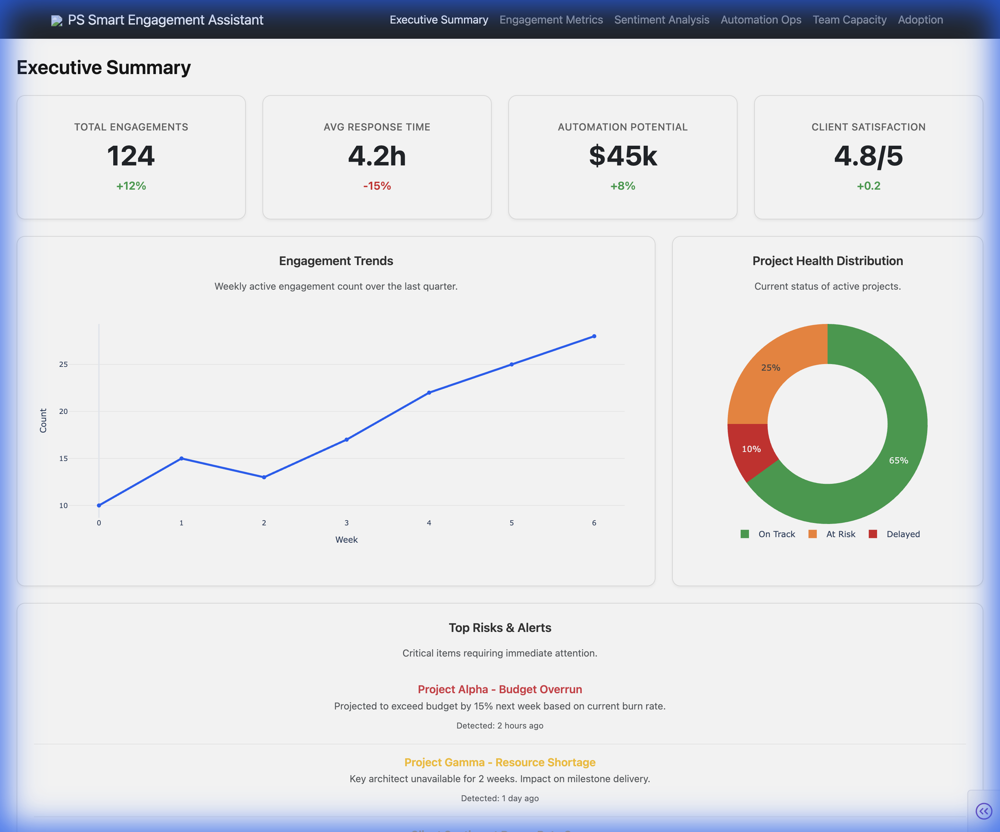
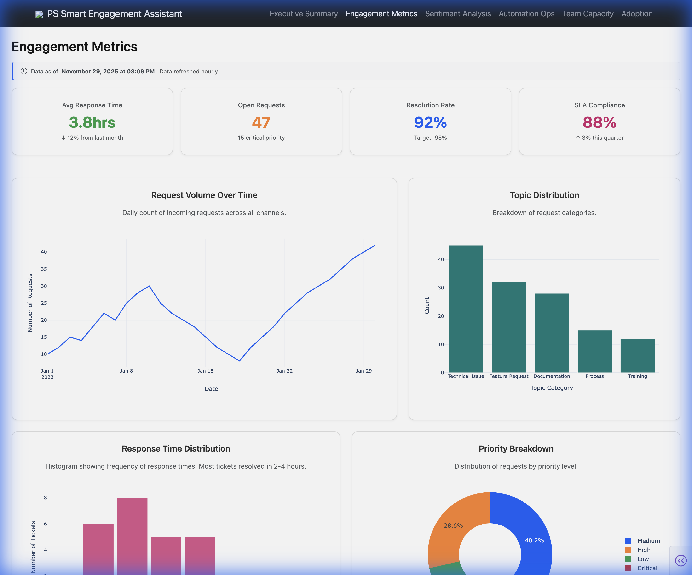
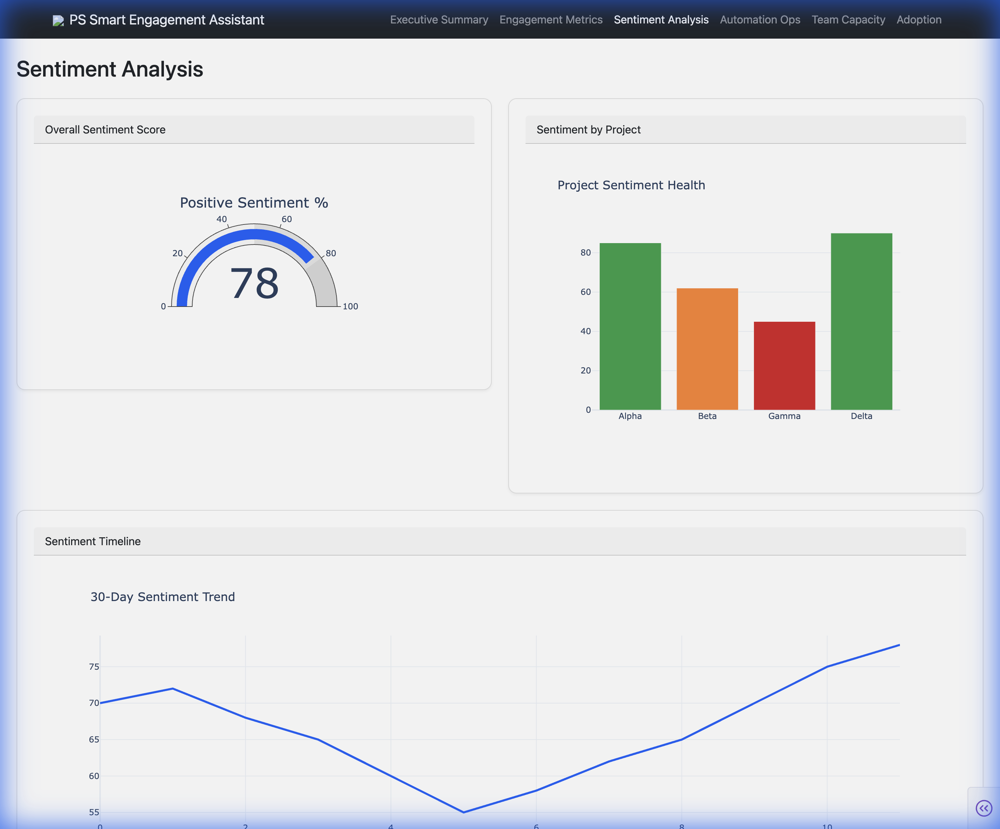
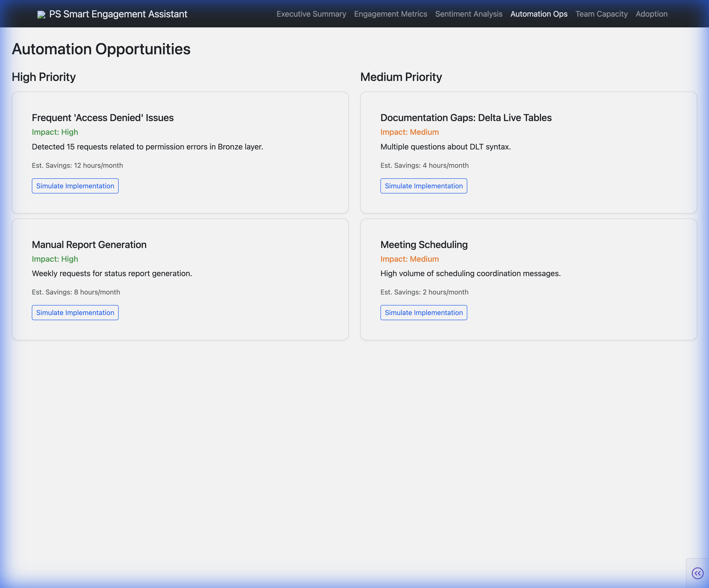
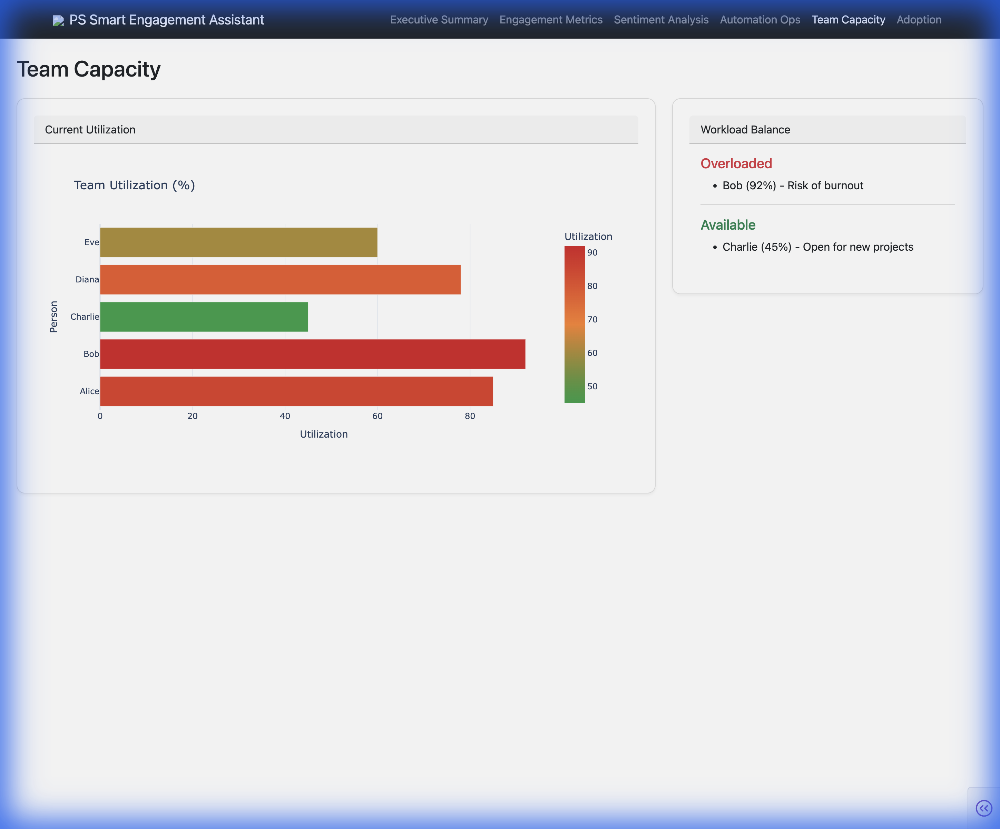
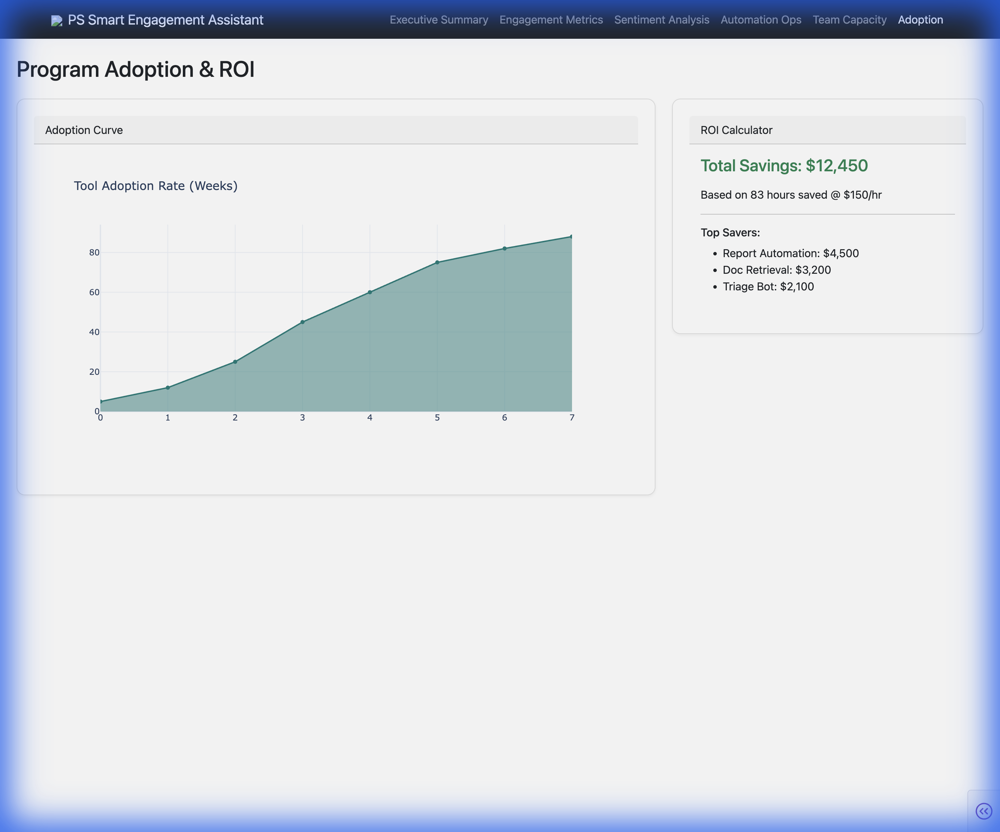
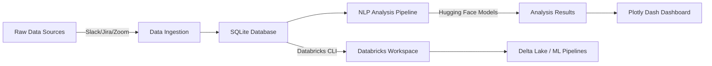

# Databricks PS Smart Engagement Assistant

> **AI-Powered Dashboard for Professional Services Engagement Analysis**

A comprehensive analytics platform that transforms raw engagement data (Slack, Jira, Zoom) into actionable insights using advanced NLP and machine learning. Built for Databricks Professional Services teams to optimize resource allocation, identify automation opportunities, and improve client satisfaction.

---

## 🎯 Project Overview

This project demonstrates a full-stack data intelligence solution that:
- **Ingests** multi-source engagement data (Slack, Jira, meeting notes)
- **Analyzes** sentiment, topics, and patterns using state-of-the-art NLP models
- **Visualizes** insights through an interactive Plotly Dash dashboard
- **Integrates** seamlessly with Databricks workspace for enterprise-grade data processing

**Use Case:** Help PS leadership make data-driven decisions on team capacity, client health, and automation ROI.

---

## 📸 Dashboard Screenshots

### Executive Summary

*High-level KPIs including total engagements, response times, automation potential, and client satisfaction. Features a weekly engagement trend chart and project health distribution donut chart.*

### Engagement Metrics

*Deep dive into request volume over time, topic distribution, and response time analysis. Helps identify spikes in demand and common request categories.*

### Sentiment Analysis

*Real-time monitoring of client sentiment across engagements. Gauge charts show overall sentiment health, with timeline tracking sentiment trends.*

### Automation Opportunities

*AI-detected automation candidates based on recurring patterns and high-frequency topics. Includes estimated time savings and implementation priority.*

### Team Capacity

*Resource utilization tracking to balance workloads and prevent burnout. Visualizes team capacity and allocation across projects.*

### Program Adoption & ROI

*Tracks the adoption of new tools and processes with ROI calculations. Helps justify automation investments with concrete metrics.*

---

## 🏗️ Architecture



---

## 🛠️ Tech Stack

### **Frontend**
- **Plotly Dash** - Interactive dashboard framework
- **Dash Bootstrap Components** - Responsive UI library
- **Plotly.js** - High-performance charting

### **Backend**
- **Python 3.8+** - Core language
- **SQLite** - Local data storage (mock environment)
- **Pandas** - Data manipulation
- **Faker** - Realistic mock data generation

### **AI/ML Models**
| Model | Purpose | Provider |
|-------|---------|----------|
| `sentence-transformers/all-MiniLM-L6-v2` | Embedding generation for clustering | Hugging Face |
| `distilbert-base-uncased-finetuned-sst-2-english` | Sentiment analysis | Hugging Face |
| `facebook/bart-large-mnli` | Zero-shot topic classification | Hugging Face |
| **K-Means + UMAP** | Message clustering for pattern detection | scikit-learn |

### **Databricks Integration**
- **Databricks CLI** - Workspace file sync
- **Delta Lake** (planned) - Scalable data lakehouse
- **MLflow** (planned) - Model tracking and deployment

---

## 🚀 Quick Start

### Prerequisites
- Python 3.8+
- Git
- Databricks workspace (optional for cloud deployment)

### Installation

1. **Clone the repository**
   ```bash
   git clone https://github.com/michaelromero212/Databricks-PS-Smart-Engagement-Assistant.git
   cd Databricks-PS-Smart-Engagement-Assistant
   ```

2. **Set up virtual environment**
   ```bash
   python3 -m venv venv
   source venv/bin/activate  # On Windows: venv\Scripts\activate
   ```

3. **Install dependencies**
   ```bash
   pip install -r requirements_lite.txt  # Lightweight for dashboard only
   # OR
   pip install -r requirements.txt  # Full ML dependencies (requires more setup)
   ```

4. **Generate mock data**
   ```bash
   python generate_mock_data.py
   python src/analysis/mock_analysis.py  # Quick mock NLP results
   ```

5. **Launch dashboard**
   ```bash
   python app.py
   ```
   Navigate to `http://127.0.0.1:8050/` in your browser.

---

## 🔗 Databricks Integration

This project includes pre-built notebooks for Databricks workspace deployment:

### Sync to Databricks
```bash
# Configure Databricks CLI (one-time setup)
databricks configure --token

# Sync notebooks to workspace
./sync_to_databricks.sh /Users/<your-email>/ps_engagement_assistant
```

### Notebooks Included
- `01_data_ingestion.py` - Ingests data from external sources to Delta Lake
- `02_data_processing.py` - Data cleaning and feature engineering
- `03_ml_pipeline.py` - Runs NLP models at scale with **MLflow tracking**
- `04_analytics.sql` - SQL queries for dashboard metrics
- `05_automation_insights.py` - Detects automation opportunities
- **`06_delta_lake_setup.py` (NEW)** - Demonstrates Delta Lake features (ACID, time travel, Z-ordering)
- **`07_job_config.json` (NEW)** - Workflow configuration for scheduled daily runs

### Advanced Databricks Integration

**Delta Lake Setup (`06_delta_lake_setup.py`):**
- Convert SQLite data to Delta format
- Demonstrate ACID transactions and upserts
- Show time travel capabilities for audit trails
- Optimize tables with Z-ordering

**Scheduled Workflows (`07_job_config.json`):**
- Defines a multi-task Databricks Job
- Schedules daily NLP analysis runs (6 AM ET)
- Email notifications on success/failure
- Demonstrates production-grade automation

**MLflow Tracking (integrated in `03_ml_pipeline.py`):**
- Logs model parameters (embedding model, cluster count)
- Tracks metrics (silhouette score, inertia)
- Versions K-Means clustering models
- Enables model registry for deployment


**Note:** The notebooks are designed to run on Databricks Runtime 13.0+ with ML libraries.

---

## 🎲 Mock Data Volume

The project now includes **12 projects** with realistic engagement volumes:
- **3,600 Slack messages** (300 per project)
- **900 Jira tickets** (75 per project)
- **240 meetings** (20 per project)
- **~1,000 action items** across all engagements

This volume is representative of a real PS organization over a 60-day period.

---

## 📂 Project Structure

```
Databricks-PS-Smart-Engagement-Assistant/
├── app.py                      # Main Dash application
├── generate_mock_data.py       # Mock data generator
├── requirements.txt            # Full dependencies (ML models)
├── requirements_lite.txt       # Lightweight dependencies
├── sync_to_databricks.sh       # Databricks sync script
│
├── src/
│   ├── data_gen/               # Mock data generators
│   │   ├── schema.py           # Database schema
│   │   ├── slack_gen.py        # Slack message generator
│   │   ├── jira_gen.py         # Jira ticket generator
│   │   └── meeting_gen.py      # Meeting notes generator
│   │
│   ├── analysis/               # NLP analysis pipeline
│   │   ├── models.py           # Model loader
│   │   ├── pipeline.py         # Analysis orchestration
│   │   ├── mock_analysis.py    # Mock results (no ML required)
│   │   └── opportunities.py    # Automation detector
│   │
│   └── dashboard/              # Dashboard components
│       ├── layout.py           # App layout
│       ├── styles.py           # Design system
│       └── pages/              # Dashboard pages
│           ├── executive.py
│           ├── engagement.py
│           ├── sentiment.py
│           ├── automation.py
│           ├── capacity.py
│           └── adoption.py
│
├── databricks/                 # Databricks notebooks
│   ├── 01_data_ingestion.py
│   ├── 02_data_processing.py
│   ├── 03_ml_pipeline.py
│   ├── 04_analytics.sql
│   └── 05_automation_insights.py
│
└── data/                       # SQLite database (gitignored)
    └── engagement.db
```

---

## 🎨 Design Philosophy

- **Colorblind-Friendly Palette** - IBM Carbon / Okabe-Ito color scheme
- **Responsive Design** - Mobile, tablet, and desktop support
- **Professional Typography** - Clean hierarchy with Inter/Roboto fonts
- **Accessibility** - WCAG AA compliant contrast ratios

---

## 🧪 Demo Mode

The project includes a **mock analysis mode** (`src/analysis/mock_analysis.py`) that generates realistic NLP results without requiring heavy ML models. This allows for:
- Quick local testing
- Fast iteration on dashboard design
- Demonstration without GPU requirements

**For production deployments**, use the full `pipeline.py` with Hugging Face models.

---

## 📊 Key Features

✅ **Multi-Source Data Ingestion** - Slack, Jira, Zoom  
✅ **Sentiment Analysis** - Real-time client health monitoring  
✅ **Topic Classification** - Zero-shot categorization of requests  
✅ **Clustering** - Pattern detection for automation opportunities  
✅ **Interactive Dashboard** - 6 specialized views  
✅ **Databricks Integration** - Enterprise-ready notebooks  
✅ **ROI Tracking** - Quantify automation savings  

---

## 🤝 Contributing

This is a demonstration project for portfolio purposes. Feel free to fork and adapt for your own use cases.

---

## 📄 License

MIT License - See LICENSE file for details

---

## 👤 Author

**Michael Romero**  
[GitHub](https://github.com/michaelromero212) | [LinkedIn](https://www.linkedin.com/in/michaelromero212/)

---

## 🙏 Acknowledgments

- **Hugging Face** - For democratizing NLP models
- **Databricks** - For inspiration on enterprise data intelligence
- **Plotly** - For powerful visualization tools
